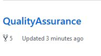

# QualityAssurance

1. Fork this repository into your own.  Do this by clicking the Fork button on the top right of this page (pictured below)
   1. 
   2. Forking is making a copy of a repository.  This will be acopy that you'll be able to change, test, etc as much as you'd like.
   3. Documentation on Forking = https://help.github.com/en/github/getting-started-with-github/fork-a-repo
   
2. Navigate to your repositories
   1. Click on your account icon at the top right of the screen
      * 
   2. click on repositories.
      * 
      
3. You should have QualityAssurance listed in your repository now.  Click on it
   * 
   
4. Click the green Clone or Download button

# QualityAssurance-Maxwell-IHCC
